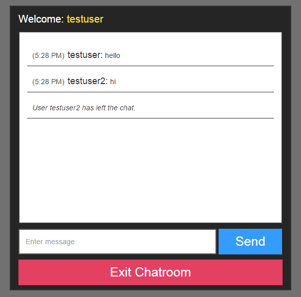

# WebChatRoom
A simple chatroom using PHP, JavaScript, JQuery, and AJAX

##Login

##Chat

##Current Version
You can create username which is then stored in a MySQL database until user exits or expires.
You cant use a username that is currently being use and has not expired yet.
Inside the chatroom, users can send messages which is saved in a log file.
The log file is read every one second to check if new messages were sent.
New messages are appended to the chatbox.